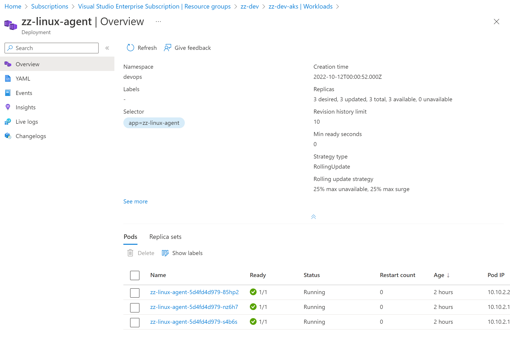
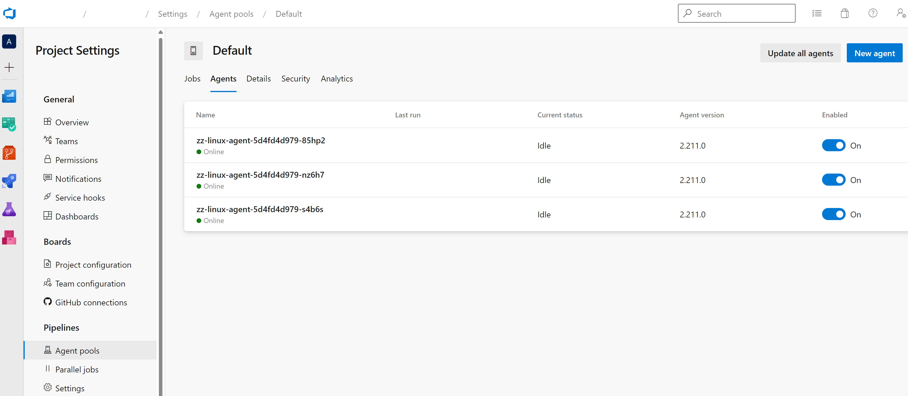

# Introduction
## Azure DevOps agent running on Linux container with deployment options in Kubernetes.

This demo shows how to create an Azure DevOps agent on Linux container and deploy into Kubernetes. The cluster used for this demo is based on Azure Kubernetes Service, but similar services such as Red Hat Openshift, EKS, or GKS can be used as well. 

# Pre-requisites
- Azure subscription
- Azure DevOps organisation
- Personal Access Token (PAT) for your DevOps org
- Windows 10 or 11 or Linux
- Docker Desktop installed on local machine (docker engine if using Linux)
- PowerShell (if using Linux, Bash can also be used, but the scripts require minor tweaks - check variable names; PowerShell Core available for Linux)
- az CLI for Azure resource management
- kubectl & kubelogin for K8S management

# Build
First, we need to build the Ubuntu-based image. The Ubuntu version is **20.04**

The image will contain several packages:
- the Azure DevOps agent based on the specified version

> Use this url to get the latest version; replace `{org}` with your Azure DevOps organization
https://dev.azure.com/{org}/_apis/distributedtask/packages/agent?$top=1

- various tools and dependencies required to run the agent properly, such as `curl`, `ca-certificates`, `git`, etc.

- .NET SDK 6.0 for .NET builds
- PowerShell Core
- az CLI
- az aks CLIs (`kubectl`, `kubelogin`)
- azcopy

Additional software can be installed as needed.

Build the image locally using docker:
``` PowerShell
$v = '2.211.0'
$imgName = 'linux-devops-agent'
$img = "$($imgName):$v"
$img
docker build -t $img --build-arg AGENT_VERSION=$v -f Dockerfile .
```

Optionally, you can test the image locally:
``` PowerShell
$org = '{org}'
$url = "https://dev.azure.com/$($org)"
$pat = '***' 
$agentName='zz-linux-agent-001'
docker run -e AZP_URL=$url -e AZP_TOKEN=$pat -e AZP_AGENT_NAME=$agentName $img
```

If using Azure Container Registry, you can deploy into the private ACR instance (ensure you are logged in):
``` PowerShell
$acrName = 'zzacr'
$acr = "$acrName.azurecr.io"
$ns = 'devops'
docker tag $img $acr/$ns/$img
# ensure login into ACR
# az acr login -n $acrName
docker push $acr/$ns/$img
```

Deploy the image into docker public registry (you will need an account and also logged in):
``` PowerShell
$regName = 'docker'
$reg = "$regName.io"
$ns = 'daradu'
$imgName = 'linux-devops-agent'
$v = '2.211.0'
$img = "$($imgName):$($v)"
docker tag $img $reg/$ns/$img
# ensure login into ACR
# docker login
docker push $reg/$ns/$img
```

# Deploy

Configure the context locally (you will need to be logged in the correct Azure subscription):
``` PowerShell
# check current context
kubectl config current-context

# merge AKS cluster credentials
$rg = 'zz-dev'
$aksName = 'zz-dev-aks'
az aks get-credentials -g $rg -n $aksName

# configure current context
kubectl config use-context $aksName

```

Create a namespace (default can also be used, but it's recommended to use a dedicated namespace):
``` PowerShell
$ns = 'devops'
kubectl create namespace $ns
```

Create a secret in the above namespace to store the PAT:
``` PowerShell
$pat = '***'
kubectl create secret generic devops-agent-secret --from-literal=pat=$pat -n $ns
```

Deploy the DevOps agent manifest:
``` PowerShell
kubectl apply -f .\deployment.yaml -n $ns
```
> Change the replicas and organization name in the *deployment.yaml* file.
If using a different image repository, change the image fully qualified name as well.

``` Yaml
spec:
  replicas: 1 # change to the desired replica count
...
      containers:
        - name: zz-linux-agent
          image: daradu/linux-devops-agent:2.211.0
          env:
          - name: AZP_URL
            value: "https://dev.azure.com/{org}" # change to use existing org
...
```

# Scale

The deployment can be scaled in and out manually based on the requirements.

Additionally, a Horizontal Pod Autoscaler (HPA) can be deployed to automatically scale the agents based on metrics such as memory or CPU.

To scale the agents manually, use the `kubectl scale` command:

``` PowerShell
$ns = 'devops'
$deploymentName = 'zz-linux-agent'
$replicas = 3
kubectl scale deployment/$deploymentName --replicas=$replicas -n $ns
```
This is a screenshot of the linux agent deployment in K8S and the corresponsing pods:



This is a screenshot of the agents registered in the Default pool of an existing Azure DevOps organization:



# Resources

- Public repo of this demo

https://github.com/ivee-tech/linux-agent-container

- Image used in this demo:

https://hub.docker.com/r/daradu/linux-devops-agent/tags

- Run in docker container

https://docs.microsoft.com/en-us/azure/devops/pipelines/agents/docker?view=azure-devops

https://medium.com/@brentrobinson5/containerised-ci-cd-pipelines-with-azure-devops-74064c679f20

https://hub.docker.com/_/microsoft-azure-pipelines-vsts-agent

https://devblogs.microsoft.com/devops/azure-devops-agents-on-azure-container-instances-aci/

https://devblogs.microsoft.com/devops/cross-platform-container-builds-with-azure-pipelines/

- Docker docs

https://docs.docker.com/

- K8S docs

https://kubernetes.io/docs/home/

